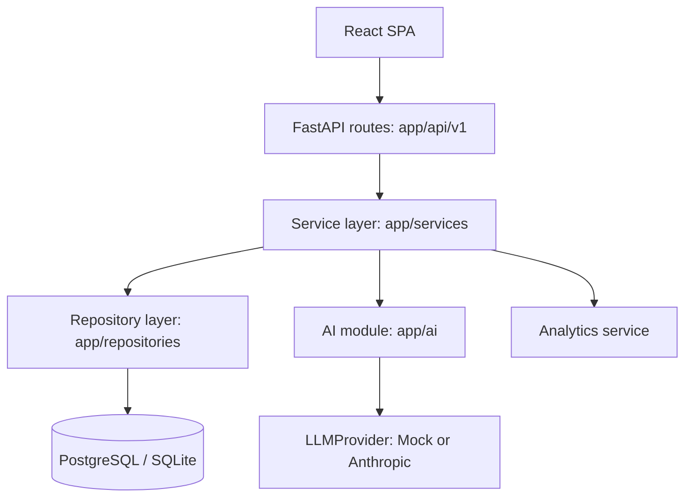
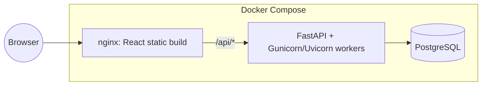

# Architecture

## Overview

Library Management System v5 is a layered, API-first application:

Each layer has one job:

- **API (`app/api/v1`)** — HTTP concerns only: request parsing (Pydantic
  schemas), auth/permission dependencies, calling exactly one service
  method, and shaping the `ApiResponse` envelope. No business logic.
- **Service (`app/services`)** — business rules, validation, and
  orchestration. Every state transition for a Loan/BookCopy/Reservation/
  Fine happens in `CirculationService`, nowhere else.
- **Repository (`app/repositories`)** — thin SQLAlchemy data access.
  Services depend on repository classes, not raw `Session` queries,
  so persistence details stay swappable.
- **Models (`app/models`)** — SQLAlchemy ORM entities and their status
  enums / allowed state-transition tables (e.g. `ALLOWED_COPY_TRANSITIONS`
  in `book_copy.py`).
- **AI (`app/ai`)** — `LLMProvider` is a `Protocol`; `MockProvider` (default,
  zero dependencies) and `AnthropicProvider` (optional) both implement it.
  `AILibrarian` grounds answers in the current catalog before calling the
  provider.

## Component responsibilities

| Component | Responsibility |
|---|---|
| `app/core/config.py` | Typed settings loaded from environment variables |
| `app/core/security.py` | Password hashing (bcrypt), JWT issue/verify |
| `app/core/dependencies.py` | `get_current_user`, centralized RBAC (`ROLE_PERMISSIONS`) |
| `app/core/middleware.py` | Request-ID injection, centralized exception → JSON mapping |
| `app/services/circulation_service.py` | Issue/return/renew/reserve, fine calculation, copy/loan state machines |
| `app/services/recommendation_service.py` | Deterministic, explainable recommendations |
| `app/services/analytics_service.py` | Dashboard KPIs, top books, category mix, monthly circulation |
| `app/ai/librarian.py` | Catalog-grounded chat, provider-agnostic |

## Data flow: issuing a book

1. `POST /api/v1/circulation/issue` (API layer) validates the request body
   and resolves `require_permission("circulation:issue")`.
2. `CirculationService.issue_book` (service layer) loads the book, finds
   the first `AVAILABLE` copy, re-validates its status (race guard),
   creates a `Loan`, and calls `_transition_copy` to move the copy to
   `ISSUED` — the only place that mutation happens.
3. The repository layer flushes the change within the request's existing
   SQLAlchemy session/transaction.
4. `AuditService` appends a `BOOK_ISSUED` entry.
5. The route commits the transaction and returns `ApiResponse[LoanOut]`.

If any step raises (e.g. `BookUnavailable`), the transaction is never
committed and no partial state (loan without a copy transition, etc.) is
persisted — see `app/database/session.get_db`, which only closes/does not
auto-commit the session, and each route explicitly calls `db.commit()`
only after the service call succeeds.

## Authentication flow

1. `POST /auth/login` → `AuthService.authenticate` verifies the bcrypt
   hash, checks `UserStatus.ACTIVE`, updates `last_login_at`.
2. `AuthService.issue_tokens` mints a short-lived access JWT and a longer
   refresh JWT (`app/core/security.py`), each carrying `sub` (user id),
   `role`, `type`, and a unique `jti`.
3. Every protected route depends on `get_current_user`, which decodes the
   access token and re-loads the user (so a disabled account is rejected
   even with a still-valid token).
4. `require_permission(...)` layers RBAC on top by checking
   `ROLE_PERMISSIONS[user.role]` — a single source of truth for what each
   role can do (see `docs/security.md`).

## AI flow

`AILibrarian.chat` finds catalog rows matching the user's message (simple
substring match against title/author) and, when it finds any, provides
them to the configured `LLMProvider` as grounding context. With
`AI_PROVIDER=mock` (the default), no network call happens at all — it's a
keyword-matching provider that also serves as the offline/test provider,
and is a generalized version of the original project's `/api/chat`
keyword dictionary. With `AI_PROVIDER=anthropic`, the same interface is
satisfied by a real Claude call.

## Deployment architecture

See `docs/deployment.md` for details.
